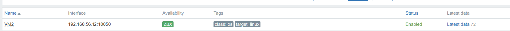
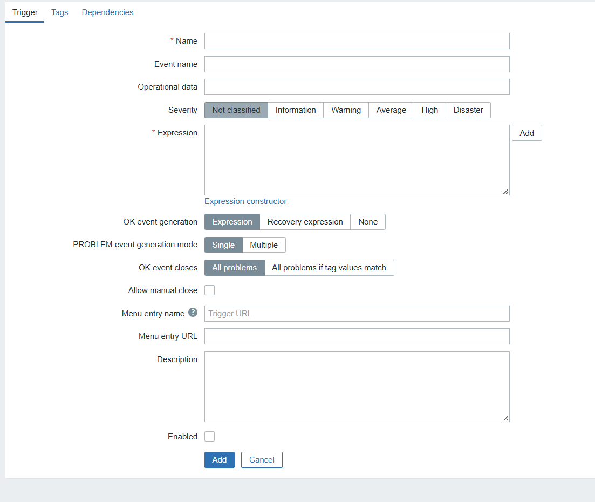

# Лабораторная Работа 3

## Требования к выполнению

1. Развернуть две виртуальные машины.
2. На VM1 установить базу данных, Zabbix Server и веб-панель Zabbix.
3. На VM2 настроить Zabbix Agent и подключить его к серверу мониторинга.

## Ход работы

Для автоматического поднятия виртуальной среды я использовал Hashicorp Vagrant.

Сначала создаём Vagrantfile, в котором описываются две ВМ:
```bash
Vagrant.configure("2") do |config|
  config.vm.box = "ubuntu/jammy64"
  config.vm.provider "virtualbox" do |vb|
    vb.memory = 1024
    vb.cpus = 1
  end

config.vm.define "vm1" do |vm1|
  vm1.vm.hostname = "vm1"
  vm1.vm.network "private_network", ip: "192.168.56.11"

config.vm.define "vm2" do |vm2|
  vm2.vm.hostname = "vm2"
  vm2.vm.network "private_network", ip: "192.168.56.12"
```

Настройка первой виртуальной машины

Для VM1 создаём docker-compose.yaml, который поднимает три контейнера: MySQL, Zabbix Server и Zabbix Web.

```yaml
version: '3.9'

services:
  zabbix-mysql:
    image: mysql:8.0
    container_name: zabbix-mysql
    command: >
      --default-authentication-plugin=mysql_native_password
      --character-set-server=utf8mb4
      --collation-server=utf8mb4_unicode_ci
    environment:
      MYSQL_DATABASE: zabbix
      MYSQL_USER: zabbix
      MYSQL_PASSWORD: zabbix-pwd
      MYSQL_ROOT_PASSWORD: root-pwd
    volumes:
      - zabbix-mysql-data:/var/lib/mysql
    networks:
      - zabbix-net
    ports:
      - "3306:3306"
    healthcheck:
      test: ["CMD", "mysqladmin", "ping", "-h", "localhost"]
      interval: 5s
      retries: 10
      timeout: 5s

  zabbix-server:
    image: zabbix/zabbix-server-mysql:6.4.0-ubuntu
    container_name: zabbix-server
    depends_on:
      zabbix-mysql:
        condition: service_healthy
    environment:
      DB_SERVER_HOST: zabbix-mysql
      MYSQL_DATABASE: zabbix
      MYSQL_USER: zabbix
      MYSQL_PASSWORD: zabbix-pwd
      MYSQL_ROOT_PASSWORD: root-pwd
    ports:
      - "10051:10051"
    networks:
      - zabbix-net

  zabbix-web:
    image: zabbix/zabbix-web-nginx-mysql:6.4.0-ubuntu
    container_name: zabbix-web
    depends_on:
      zabbix-server:
        condition: service_started
    environment:
      ZBX_SERVER_HOST: zabbix-server
      DB_SERVER_HOST: zabbix-mysql
      MYSQL_DATABASE: zabbix
      MYSQL_USER: zabbix
      MYSQL_PASSWORD: zabbix-pwd
      MYSQL_ROOT_PASSWORD: root-pwd
    ports:
      - "8080:8080"
    networks:
      - zabbix-net

volumes:
  zabbix-mysql-data:

networks:
  zabbix-net:
    driver: bridge
```

В Vagrantfile прописываем копирование файлов и автозапуск docker-compose:

```bash
    vm1.vm.synced_folder "./vm1_data", "/home/vagrant/vm1_data"

    vm1.vm.provision "shell", inline: <<-SHELL
      sudo apt update -y
      sudo apt install -y docker.io docker-compose
      sudo systemctl enable --now docker

      cd /home/vagrant/vm1_data
      sudo docker-compose up -d
    SHELL
```

Настройка второй виртуальной машины

VM2 запускает только контейнер с агентом Zabbix:

```bash
    vm2.vm.provision "shell", inline: <<-SHELL
      sudo apt update -y
      sudo apt install -y docker.io

      sudo docker run -d --name zabbix-agent \
        -e ZBX_SERVER_HOST=192.168.56.11 \
        -e HOSTNAME=vm2 \
        -p 10050:10050 \
        zabbix/zabbix-agent:alpine-7.0-latest
    SHELL
```

После этого достаточно выполнить:

```bash
vagrant up
```

Настройка Zabbix

Переходим в интерфейс Zabbix:
http://192.168.56.11:8080 

Авторизация:
Admin / zabbix

Добавляем хост с агентом:
Monitoring → Hosts → Add
Указываем IP агента: 192.168.56.12, порт 10050

Проверяем доступность (ping)


Прикрепляем шаблон метрик:



Смотрим поступающие данные:


Создаём триггер:



Настраиваем дашборд по желанию:


## Контрольные вопросы

1. Роль компонентов Zabbix
    
  Zabbix Server — получает данные от агентов, хранит их и обрабатывает триггеры.

  Zabbix Agent — собирает параметры системы на конкретном хосте.

  Zabbix Web — интерфейс, через который пользователь смотрит метрики.

2. Схема движения данных

  Агент → Zabbix Server → Web-панель отображает полученную информацию.

3. Определения

  Trigger — логическое условие, которое определяет, когда должна возникнуть проблема.

  Item — единичный источник данных (метрика), на основе которого работают триггеры.