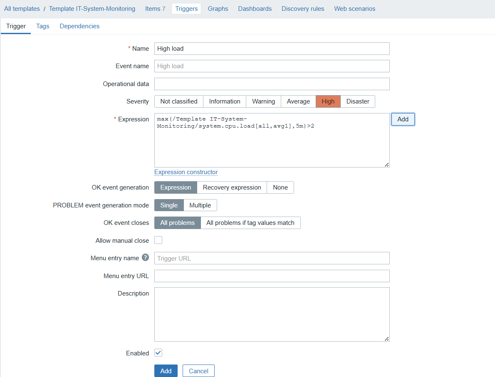
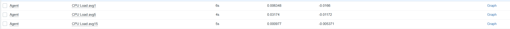
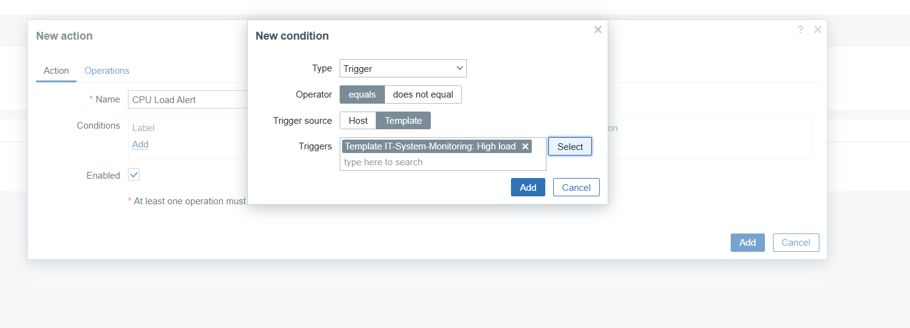
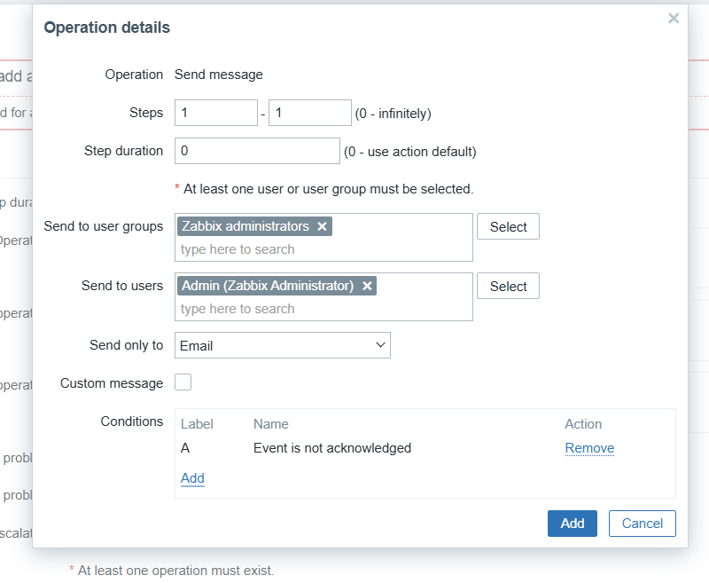

# Лабораторная Работа 4

## Цель работы
Получить практический опыт работы с продвинутым функционалом Zabbix: построением графической аналитики, созданием отчётов, применением нестандартных элементов данных, анализом взаимосвязей метрик и улучшением эффективности системы мониторинга.

## Задачи
1. Освоить использование зависимых (dependent) и вычисляемых (calculated) элементов данных.
2. Настроить шаблоны для удобного управления группами хостов.
3. Создать собственные графики и автоматизированные отчёты.
4. Научиться анализировать и сравнивать разные типы метрик (например, загрузку CPU, использование памяти, сетевой трафик).
5. Реализовать оповещения, реагирующие на несколько условий.
6. Оптимизировать частоту сбора данных и механизм уведомлений.

## Выполнение 

Сначала снова поднимем окружение Zabbix тем же способом, что и в предыдущей лабораторной:
```vagrant up```

Создаём новый шаблон:


Добавляем необходимые элементы данных:


Создаём триггер:



Привязываем созданный шаблон к выбранному хосту:


Проверяем поступление данных:



Добавляем Calculated item:


Создаём Dependent item:


Добавляем действие (Action), реагирующее на срабатывание триггера:






## Контрольные вопросы

1. Разница между Dependent и Calculated item:
Dependent item использует данные основного элемента (master item) и может их преобразовывать. Calculated item формирует новое значение на основе формулы, в которую могут входить сразу несколько других элементов.

2. Совместное отображение метрик на одном графике:
Несколько параметров можно визуализировать в одном графике, добавив их как отдельные линии с индивидуальным цветом или собственной шкалой Y.

3. Преимущества шаблонов:
Шаблоны позволяют быстро перенастраивать множество хостов, избегать ошибок при ручной конфигурации и централизованно управлять элементами данных, триггерами и графиками.

4. Влияние интервала обновления:
Более частый опрос даёт детализированные данные, но повышает нагрузку на сервер и агентов. Реже обновление уменьшает нагрузку, но снижает точность мониторинга.