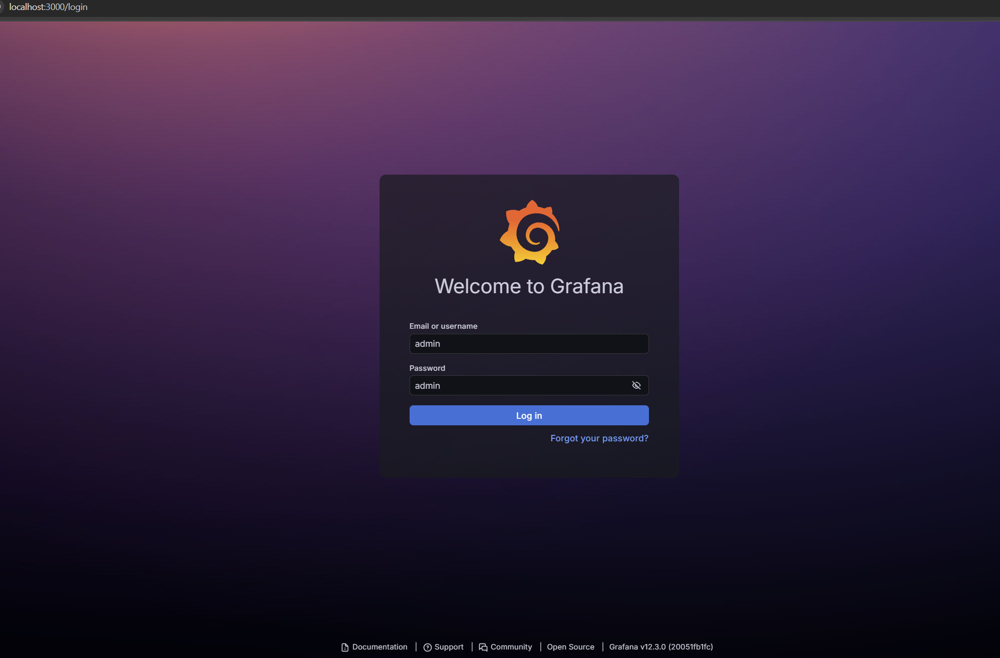
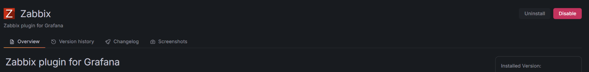
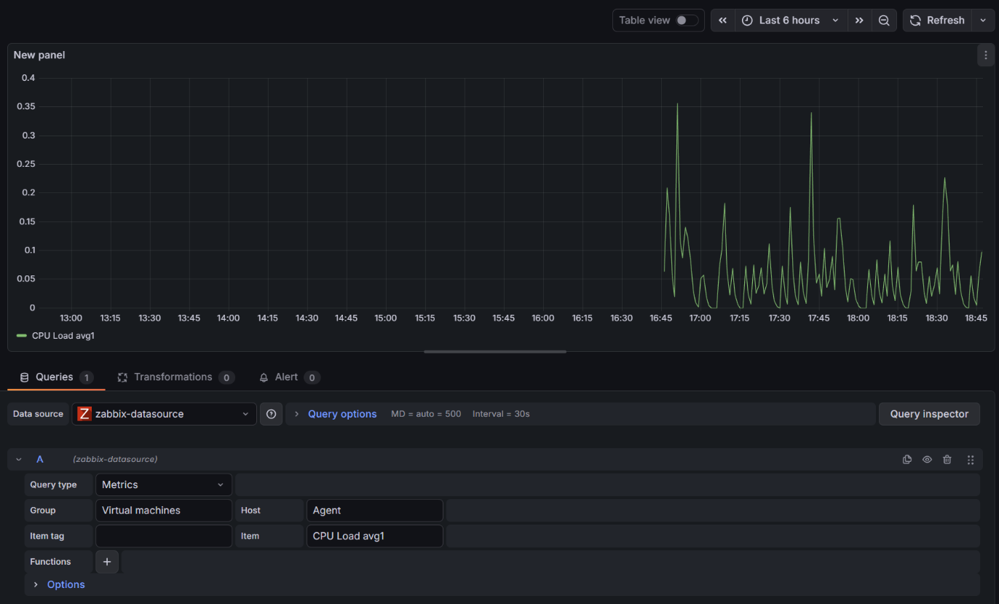
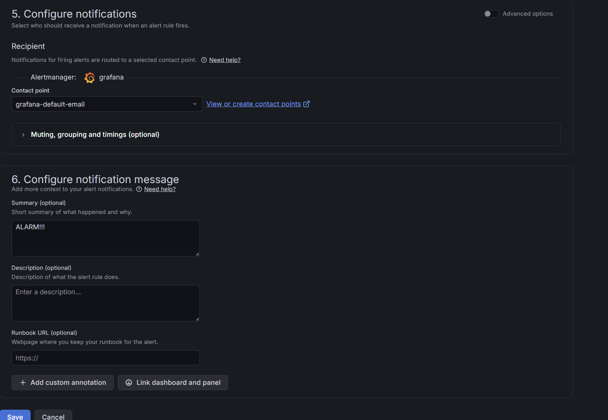

# Лабораторная Работа 5

## Цель работы
В ходе этой работы студенты познакомятся с системой Grafana — инструментом для наглядной визуализации данных, получаемых из Zabbix. В рамках задания требуется освоить установку Grafana, подключение плагина для интеграции с Zabbix, а также создание интерактивных панелей (dashboards) для анализа собранных метрик.

## Выполнение

Для удобства развернём Grafana локально, используя Docker-контейнер:

```bash
docker run -d -p 3000:3000 --name=grafana --restart=always -e "GF_SECURITY_ADMIN_USER=admin" -e "GF_SECURITY_ADMIN_PASSWORD=admin" -e "GF_INSTALL_PLUGINS=alexanderzobnin-zabbix-app" grafana/grafana:latest
```

После запуска переходим в браузере на localhost:3000 и заходим под администратором.



Активируем Zabbix-плагин и добавляем новый источник данных (Data Source):



Создаём источник данных, указав адрес API Zabbix: http://192.168.56.10:8080/api_jsonrpc.php


Добавляем необходимые метрики в дашборд:



Настраиваем правило оповещения (Alert):




## Вопросы

1. Плагин для Zabbix в Grafana нужен для получения и отображения данных мониторинга из Zabbix внутри графических панелей Grafana.

2. Zabbix API служит интерфейсом, через который Grafana делает запросы и получает значения метрик, событий и другую мониторинговую информацию.

3. Graph panel визуализирует данные как временные ряды на графике, а Stat panel показывает итоговые или текущие значения в виде отдельных числовых карточек.

4. Переменная dashboard позволяет динамически менять фильтры и параметры отображения данных на панели, не изменяя настройки самих запросов.

5. Чтобы настроить Alert на основе данных Zabbix, в Grafana создают правило уведомлений, которое отслеживает определённые условия для получаемых метрик и отправляет оповещения при их нарушении.